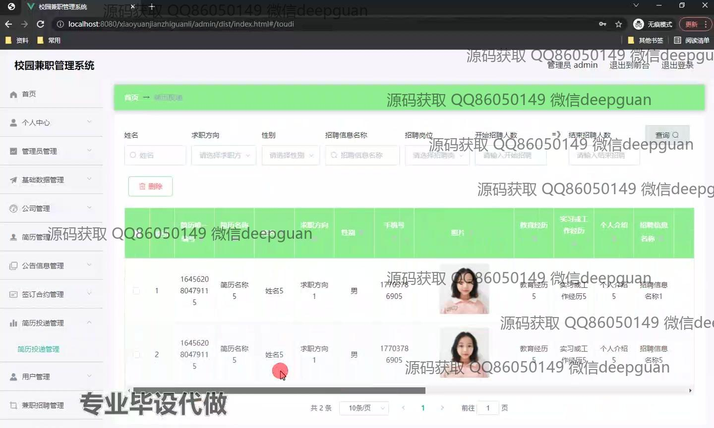

<h1 align="center">基于SSM的校园兼职管理系统设计+vue</h1>

## 简介
校园兼职管理系统：角色分为管理员、用户；功能包括简历管理、招聘信息发布、合同管理、用户信息维护等，提高校园兼职工作的组织和管理效率。    --计算机毕业设计源码；毕设源码；java毕业设计源码

## 联系方式

<h3 align="center">获取完整代码与数据库文件 + 微信：deepguan QQ: 86050149 QQ群: 783742310</h3>

<h3 align="center">可帮忙远程部署 包运行成功！提供远程部署、修改代码、设计文档指导、代码讲解等服务！</h3>

## 功能介绍（完整见运行截图）
管理员： 管理员可以通过后台管理模块进入系统，进行综合管理操作，包括登录、注册和用户信息的维护。系统允许管理员管理招聘信息、简历投递及相关数据，支持信息的添加、删除、修改和状态更新。管理员能够管理用户信息和学生求职资料，确保招聘流程的顺畅进行，并提供系统各类数据的动态更新和公告信息管理。

用户： 用户通过个人中心可以查看和修改自己的基本信息，管理自己的简历和求职意向。系统提供登录和注册功能，支持用户根据不同招聘信息投递简历，并可查看合同管理、公告信息及个人参与的招聘活动状态。用户可以在系统中选择适合自己的兼职岗位，并对相关的公告信息进行浏览和使用。

## 运行截图

本代码来源于网络,仅供学习参考使用!

